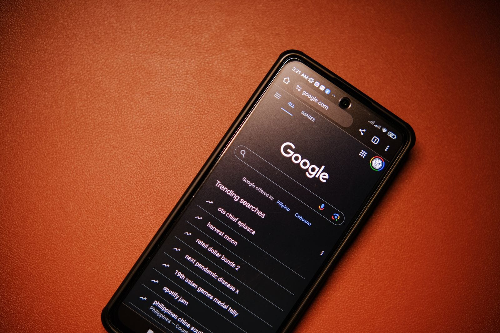

> **Resposta curta:** agência que cobra por resultado é a que recebe uma parte do que você vende, no lugar de uma mensalidade fixa ou junto com ela. O formato mais comum soma um fixo menor a um percentual da venda, o chamado success fee. Vale a pena quando a sua margem comporta o percentual e quando o contrato diz, com todas as letras, o que conta como venda.

## O que é uma agência que cobra por resultado?

É uma empresa de marketing ou de vendas que amarra o próprio pagamento ao resultado do cliente, e não só às horas trabalhadas. Na agência tradicional, você paga a mensalidade vendendo ou não. Na agência por resultado, pelo menos parte do que ela recebe depende do que acontece do seu lado do balcão.

O nome dessa parte variável é **success fee**, ou taxa de sucesso: um percentual pago só sobre o resultado combinado em contrato, em geral a venda concretizada. Sem resultado, o success fee é zero. Na prática, ele costuma vir somado a uma parte fixa menor, que paga o custo de manter a operação no ar enquanto a venda não chega.

A letra miúda começa na palavra "resultado". Ela pode querer dizer quatro coisas bem diferentes:

- **contato** (o lead): alguém deixou nome e telefone;
- **reunião**: alguém aceitou conversar;
- **pedido**: alguém pediu, mas ainda pode desistir ou não pagar;
- **venda paga**: o dinheiro entrou.

Quanto mais perto da venda paga estiver a definição, mais o risco fica com a agência. Quanto mais perto do contato, mais ele volta para você.

## Quais são os modelos de cobrança por resultado?

São cinco, e eles mudam em dois pontos: quanto você paga no mês em que nada vende e quem paga o tráfego que traz o cliente.

| Modelo | Você paga sem vender? | A comissão incide sobre | Quem paga o tráfego | Onde costuma dar errado |
| :-- | :-- | :-- | :-- | :-- |
| Só comissão | Não | Venda | A agência | Ela escolhe o que vende fácil e some quando não vende |
| Fixo + comissão | Sim, um fixo menor | Venda ou meta | Em geral você, com verba de anúncio à parte | O risco do anúncio volta para você |
| Por contato (lead) | Sim, por contato entregue | Contato | A agência | Contato ruim custa o mesmo que contato bom |
| Por reunião | Sim, por reunião feita | Reunião | A agência | Reunião não é venda |
| Anuidade + comissão (ROI Labs) | Só a anuidade: R$ 3.960/ano | Venda concretizada | A ROI Labs | Exige margem, estoque e despacho no prazo |

O modelo **só comissão** parece o mais seguro, mas é o que menos se sustenta: alguém precisa pagar tecnologia, conteúdo e tráfego até a primeira venda, e quem não recebe nada no começo tende a escolher os clientes fáceis ou a desistir cedo. O **fixo + comissão** é o mais comum; o cuidado é conferir se a verba de anúncio está dentro do fixo ou é mais uma conta sua. Nos modelos **por contato** e **por reunião**, a agência recebe antes de existir venda, então a qualidade do contato vira o centro da negociação.

O quinto modelo é o que a ROI Labs usa: uma anuidade pela cadeira do nicho e um percentual só sobre a venda concretizada, com a tecnologia e o tráfego bancados pela ROI Labs. A fórmula completa está na página do [modelo Growth Partner](/modelo/).

*No contrato por resultado, o que conta como venda precisa estar escrito. Foto: [Mikhail Nilov / Pexels](https://www.pexels.com/photo/business-people-making-agreement-8297625/)*

## Se a agência só ganha quando você vende, de onde vem o cliente?

Vem, na maior parte das vezes, da busca no Google. Quem cobra por resultado e paga cada clique de anúncio do próprio bolso só aguenta nichos de margem muito alta; por isso o modelo combina com a busca orgânica, em que ninguém paga por clique.

A diferença de custo é grande. No Google Keyword Planner (Brasil, agosto de 2026), anunciantes chegam a pagar **R$ 32,95 por um único clique** na busca "fitas adesivas personalizadas". Esse valor sai a cada visita, compre a pessoa ou não. E no dia em que a verba acaba, as visitas acabam junto: o anúncio é aluguel.

A página que aparece na busca orgânica funciona como imóvel. Depois de publicada e indexada, ela continua trazendo gente sem custo por clique. O preço é o tempo: de 3 a 6 meses até o volume estabilizar. É o motor do [SEO programático](/blog/o-que-e-seo-programatico-pseo-revestimentos/), que cria uma página para cada combinação de produto e necessidade que as pessoas realmente procuram.

> **Na prática:** o site da Use Aligner, de alinhadores invisíveis, começou do zero e é uma das cadeiras da ROI Labs. No Google Search Console, de setembro de 2025 a setembro de 2026, ele apareceu **369 mil vezes** nas buscas do Google, recebeu **4.900 visitas** vindas do Google sem nenhum anúncio e ficou na **posição média 4,8**. Tráfego 100% orgânico. São visitas, não vendas: mostram o tamanho da vitrine que a busca abre.

*Quem procura o seu produto no Google já está com a compra na cabeça. Foto: [Click Jeth / Pexels](https://www.pexels.com/photo/google-in-smartphone-18530501/)*

## Quanto custa, na prática?

A conta tem duas linhas, a parte fixa e o percentual sobre a venda, e o que sobra é seu. Veja um exemplo com números redondos, o mesmo da página do modelo da ROI Labs: ticket médio de R$ 450 e 40 pedidos por mês vindos do canal.

| Linha da conta | Valor no mês |
| :-- | :-- |
| Vendas geradas pelo canal (R$ 450 × 40) | R$ 18.000 |
| Success fee de 10% (exemplo) | − R$ 1.800 |
| Anuidade da cadeira (R$ 3.960 ÷ 12) | − R$ 330 |
| **Fica com você** | **R$ 15.870 (88% da venda)** |

Três números dessa conta merecem atenção:

1. **No mês em que nada vende**, o custo é só a anuidade: R$ 330. O success fee vai a zero.
2. **O custo por venda** é de R$ 53,25: a parte fixa mais a comissão (R$ 330 + R$ 1.800), dividida pelos 40 pedidos. É a métrica que quase ninguém mostra e a melhor para comparar propostas.
3. **O mesmo cliente pelo anúncio** pode sair bem mais caro. Se 1 em cada 50 cliques virar compra (2%, uma hipótese; troque pela sua taxa real), a R$ 32,95 por clique, cada venda custaria R$ 1.647,50 só em anúncio.

É um exemplo ilustrativo, não uma proposta comercial: na ROI Labs, o percentual é definido em contrato, conforme nicho, margem do produto e prazo de estoque e despacho. Faça a conta com os seus números no [simulador de receita](/simulador/). Para comparar com uma agência de mensalidade, linha a linha, [este comparativo](/blog/growth-partner-vs-agencia-revestimentos/) faz a conta nos dois modelos.

*No mês sem venda, o modelo de anuidade + comissão custa R$ 330. Foto: [Daniel Dan / Pexels](https://www.pexels.com/photo/brazilian-real-banknotes-in-closeup-7542641/)*

## Quem atende o cliente e fecha a venda?

É o ponto que mais separa um modelo do outro. A maioria das agências por resultado entrega o contato e para aí: quem responde, tira dúvida, negocia e fecha é a sua equipe. Se ninguém atende rápido, o resultado que você pagou para receber esfria na caixa de entrada.

A velocidade pesa mais do que parece. Um estudo publicado na Harvard Business Review em 2011, que testou 2.241 empresas dos Estados Unidos, mostrou que quem tentava falar com o cliente em até uma hora tinha quase sete vezes mais chance de qualificar o contato do que quem tentava uma hora mais tarde. E 23% das empresas nunca responderam ([The Short Life of Online Sales Leads](https://hbr.org/2011/03/the-short-life-of-online-sales-leads)).

Por isso vale perguntar, antes de assinar: **quem atende o cliente que chega?** No modelo da ROI Labs, quem atende é a equipe de vendas da própria ROI Labs. Ela responde todo cliente que chega pelo site, conduz a conversa, fecha a venda e entrega a venda pronta para a empresa. Você não precisa montar um time só para dar conta do canal. Os detalhes estão em [como funciona o modelo](/modelo/).

*Quem responde o cliente rápido decide se o contato vira venda. Foto ilustrativa: [Yan Krukau / Pexels](https://www.pexels.com/photo/a-smiling-woman-working-in-a-call-center-while-looking-at-camera-8867434/)*

## Depois da venda: quem fatura, entrega e fica com o cliente?

A sua empresa, e isso precisa estar escrito: a venda sai no seu nome, você fatura e despacha, e o cadastro do comprador é seu. Um parceiro que fatura no nome dele e guarda a lista de clientes deixa você dependente dele para sempre.

Também vale combinar o que acontece na **recompra**. O cliente que comprou uma vez tende a comprar de novo, e essa segunda venda não precisa de anúncio nem de busca nova. Há contratos que cobram o mesmo percentual na recompra, outros que cobram menos e outros que não cobram nada. Pergunte qual é o seu.

Na ROI Labs, a venda sai no nome do fornecedor: o cliente compra dele, a empresa fatura e despacha, e o cliente é da empresa. A ROI Labs não cuida da entrega. O que a equipe da ROI Labs faz depois da venda é trabalhar a recompra desse cliente para a empresa.

*A venda sai no nome da empresa, que fatura e despacha. Foto: [Kampus Production / Pexels](https://www.pexels.com/photo/close-up-of-person-packing-an-order-into-a-cardboard-box-7857523/)*

## Quando vale a pena e quando não vale?

Vale a pena quando a conta fecha dos dois lados: a sua margem paga o percentual com folga e o parceiro consegue trazer venda sem pagar clique caro. O modelo por resultado combina com a empresa que:

- tem **margem bruta** que comporta o percentual e ainda sobra para frete, imposto e devolução;
- vende um produto que **as pessoas já procuram** no Google, mesmo que ainda não encontrem você;
- consegue **manter estoque e despachar no prazo**, porque a venda que atrasa volta como reclamação;
- tem um **ticket** que paga o esforço de atender, negociar e fechar.

E não combina quando:

- a margem é muito fina e qualquer comissão come o lucro;
- o produto é novo e ninguém procura por ele ainda (aí o trabalho é criar demanda, não capturar);
- a empresa precisa de venda em 30 dias: a busca orgânica leva de 3 a 6 meses para estabilizar;
- a empresa não quer abrir os números de venda, porque o modelo depende de relatório pedido a pedido.

## O que exigir no contrato antes de assinar?

Oito pontos, escritos com clareza, evitam quase toda briga no modelo por resultado:

1. **O que conta como venda:** pedido feito, venda paga ou venda sem devolução.
2. **Até quando a venda conta:** quantos dias depois do primeiro contato a comissão ainda vale.
3. **Relatório pedido a pedido** e acesso aos dados de visitas e buscas, como o Search Console.
4. **Percentual da recompra**, se for diferente do da primeira compra.
5. **Prazo e forma de pagamento** da comissão.
6. **Exclusividade:** o parceiro pode atender o seu concorrente direto?
7. **Propriedade:** de quem são o site, o domínio e a lista de clientes se a parceria acabar.
8. **Saída:** duração do contrato, aviso prévio, multa e regra de renovação.

Na ROI Labs, o contrato da cadeira é anual e renovável pelo desempenho dos dois lados, a comissão vem com relatório pedido a pedido e a exclusividade é de uma empresa por nicho no Brasil inteiro. Veja por que em [exclusividade de cadeira](/blog/exclusividade-de-cadeira-uma-loja-por-nicho-goiania/).

*Peça relatório pedido a pedido: é ele que prova a comissão. Foto: [Wolf Art / Pexels](https://www.pexels.com/photo/person-analyzing-data-on-laptop-screen-34639577/)*

## Em resumo

- Agência que cobra por resultado recebe parte do que você vende; o formato mais comum é um fixo menor mais o success fee.
- Compare os modelos por três perguntas: quanto custa o mês sem venda, quem paga o tráfego e o que conta como "resultado".
- Antes de assinar, pergunte quem atende o cliente, de quem é o cliente depois da venda, e peça as oito respostas por escrito.

*Transparência: a ROI Labs trabalha com um desses modelos, o de anuidade + comissão. Por isso este guia mostra também quando ele não vale a pena.*
